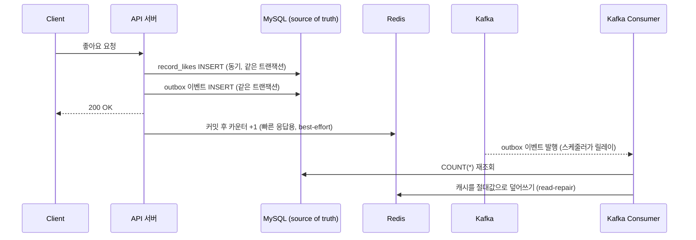
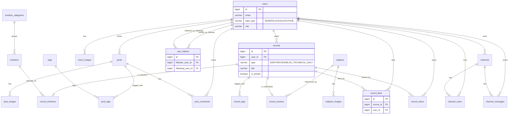

# ✍ log — 기록 중심 개인 서비스 (2024.08.08 ~ )

일상/기술 블로그, 리뷰, 일기 같은 **"기록(Record)"을 중심 도메인**으로 두고, 그 위에 팔로우·좋아요·댓글·채널 같은 SNS적 요소가 더해지는 개인 프로젝트입니다. 전체 도메인을 한 번에 완성하기보다 **우선순위를 정해 DDD 원칙을 점진적으로 적용**하고 있고, 실제로 부하가 몰릴 수 있는 지점에는 **대규모 트래픽을 가정한 설계**(캐시-어사이드 + Kafka 기반 정합성 복구)를 선택적으로 적용해 나가고 있습니다.

## [프론트엔드 프로젝트 레포로 이동](https://github.com/chobolevel/log-fe)

## 목차

> 1. [기술 스택](#기술-스택)
> 2. [아키텍처 하이라이트](#아키텍처-하이라이트)
> 3. [테스트 전략](#테스트-전략)
> 4. [DB 스키마](#db-스키마)
> 5. [CI/CD](#cicd)
> 6. [로드맵](#로드맵)
> 7. [주요 기능 상세](#주요-기능-상세)

## 기술 스택

> 
> 
> 
> 
> 
> 
> 
> 
> 
> 
> 
> 
> 
> 
> 
> 
> 
> 
> 
> 
> 

Kotlin 1.8.21 · Spring Boot 3.1.0 · JVM 17 · Gradle(Kotlin DSL) 멀티모듈(`domain` / `api`)

## 아키텍처 하이라이트

### 캐시-어사이드 + Kafka read-repair

좋아요·조회수·팔로워 수처럼 **읽기가 압도적으로 많고 정합성이 최종적으로만 맞으면 되는 카운터**에 한해, "부하는 캐시로 흡수하고, 캐시를 쓰면서 생기는 정합성 문제는 이벤트로 감지·복구한다"는 원칙을 적용했습니다. 전체 도메인에 일괄 적용한 게 아니라 **실제로 부하가 몰릴 수 있는 지점만 선별**해서 넣었습니다.

- **동기 쓰기 + 비동기 read-repair**: 실제 row는 API 요청 트랜잭션에서 동기로 저장해 항상 정확한 source of truth로 두고, Redis 캐시는 커밋 후 델타로 빠르게 반영합니다. 델타 반영이 실패해도 Kafka 컨슈머가 **매 이벤트마다 DB를 다시 읽어 캐시를 절대값으로 덮어쓰기 때문에 자동으로 교정**됩니다(델타 재적용이 아니라 절대값 overwrite라 메시지가 몇 번 재전달돼도 결과가 동일).
- **Outbox 패턴**: DB 트랜잭션과 Kafka 발행을 분리해 "DB는 성공했는데 이벤트 발행은 실패"하는 상황을 차단. 스케줄러가 PENDING 이벤트를 청크 단위로 릴레이합니다.
- **DLQ + 관리자 수동 재처리**: 3회 재시도 후에도 실패하면 DLQ로 보내고 상태만 남깁니다. 자동 재발행 대신 관리자 수동 트리거로, "재시도 토픽 ↔ DLQ 무한 루프" 위험을 설계 자체에서 없앴습니다.
- **분산락 (Redisson)**: 팔로우/언팔로우처럼 카운터 두 개(팔로잉/팔로워)가 함께 바뀌는 동작은 Facade 계층에서 분산락으로 감싸 경합을 방지합니다. 락이 트랜잭션 커밋까지 보호하도록 Facade(락)/Service(`@Transactional`) 2-빈 구조로 분리했습니다.
- **Poison-pill 방어**: 역직렬화 실패 메시지 하나가 파티션 전체를 영구적으로 막는 걸 막기 위해 `ErrorHandlingDeserializer`를 도입 — 부하테스트 중 실제로 발견해서 고친 버그입니다.

### 부하테스트로 검증한 캐시 크로스오버 지점

"캐시 없이 DB에 매번 `COUNT(*)`를 날리는 구현"과 위 read-repair 구현을 k6로 같은 조건에서 비교했습니다.

| 좋아요 row 수 | 캐시 읽기 평균 | naive(COUNT(*)) 읽기 평균 | 배율 |
|---|---|---|---|
| 100 | 4.55ms | 4.34ms | 0.95배 (차이 없음) |
| 1,000 | 5.68ms | 4.20ms | 0.74배 |
| 10,000 | 4.27ms | 8.05ms | **1.89배** |
| 50,000 | 4.48ms | 19.21ms | **4.29배** |
| 100,000 | 3.26ms | 17.10ms | **5.25배** |

**약 1만 건을 넘어가는 시점부터 캐시가 실질적 이득으로 전환된다**는 걸 실측으로 확인했습니다. 전체 실험 과정(처음엔 가짜 결과에 속을 뻔했던 이야기 포함)은 [별도 글](https://velog.io/@rodaka123/posts)로 정리했습니다.

### DDD 리팩토링 — 진행 상황

서브 도메인 엔티티는 애그리거트 루트를 통해서만 생성되도록(팩토리를 `internal`로 제한) 점진적으로 옮기는 중입니다. 한 번에 전체를 바꾸기보다, 카운터/정합성 이슈가 실제로 있었던 도메인부터 우선 적용했습니다.

| 상태 | 엔티티 |
|---|---|
| ✅ 완료 (internal 팩토리, 애그리거트 루트 경유) | `RecordReview`, `RecordEmotion`, `SubjectImage`, `UserFollow` |
| ⏳ 다음 리팩토링 대상 (아직 public) | `RecordLike`, `PostComment`, `PostImage`, `PostTag`, `RecordTag`, `UserImage`, `ChannelMessage`, `ChannelUser` |

### 검증 계층 분리

책임에 따라 3단으로 나눠서 검증합니다.

| 레이어 | 위치 | 의존성 | 검증 대상 |
|---|---|---|---|
| ParameterValidator | 컨트롤러 | 없음 (순수 함수) | 요청이 형식적으로 온전한가 |
| BusinessValidator | 서비스 | Repository/Provider | 현재 시스템 상태상 이 동작이 허용되는가 |
| 엔티티 `require()` | 엔티티 생성자 | 없음 | 어떤 경로로 만들어지든 항상 참이어야 하는 불변식 |

단일 필드의 정적 제약(형식·범위·길이)은 커스텀 Validator보다 Bean Validation(`@field:Min` 등)을 우선 적용합니다.

## 테스트 전략

Kotest(BehaviorSpec) + MockK 기반으로 단위 테스트부터, `@WebMvcTest`/`@DataJpaTest` 슬라이스 테스트, Testcontainers 기반 MySQL 통합 테스트까지 3단계로 구성했습니다.

- **단위 테스트**: 서비스/검증기(Validator)/업데이터(Updater) 등 비즈니스 로직 — given/when/then 구조, 과도한 mocking 지양(mock 3개 이상이면 설계를 의심)
- **슬라이스 테스트**: 컨트롤러(`@WebMvcTest`)와 리포지토리(`@DataJpaTest`)를 계층별로 필요한 범위만 검증
- **통합 테스트**: 실제 MySQL 컨테이너(Testcontainers, Singleton Container 패턴)로 H2와의 SQL 방언 차이(예약어 컬럼, LIKE 대소문자 감각 차이 등)를 실제로 잡아낸 사례가 있음
- 테스트 클래스 89개 — `./gradlew :api:test`로 실행
- **부하테스트(k6)**: 기능 테스트를 통과하는 것과 "설계한 대로 트래픽을 받아낼 수 있는가"는 별개라는 관점에서, 캐시/Kafka가 실제로 이득을 주는지 k6로 직접 검증 (위 [아키텍처 하이라이트](#아키텍처-하이라이트) 참고)

## DB 스키마

히스토리 테이블(Envers `_histories`)과 Kafka outbox 테이블(`*_sync_events`)은 가독성을 위해 다이어그램에서 생략했습니다 — 모든 테이블은 등록/수정/삭제 시 히스토리가 자동 기록되고, 좋아요/조회수/팔로우는 각각 대응하는 `*_sync_events` 아웃박스 테이블을 하나씩 더 가집니다.

## CI/CD

- **github actions, Jib 라이브러리, 도커 허브, Makefile, docker-compose**로 브랜치 푸시 이벤트를 감지해 도커 이미지를 빌드·푸시하도록 구성했습니다.
- 서버에서는 Makefile 커맨드로 도커 허브에서 이미지를 받아 컨테이너로 실행합니다.
- PR 생성 시 GitHub Actions에서 **테스트(`./gradlew :api:test`)와 ktlint 검사**를 자동으로 실행합니다.

## 로드맵

- **AI 기반 주간/월간 리포트**: 작성한 기록을 바탕으로 AI가 주간·월간 단위 요약 리포트를 생성해주는 기능 (설계/개발 예정)
- **커버리지 측정 + CI 게이트**: Jacoco 도입, 커버리지 기준 위험 영역 식별
- **나머지 서브 도메인 DDD 정리**: 위 [DDD 리팩토링 진행 상황](#ddd-리팩토링--진행-상황) 표의 "다음 대상" 엔티티들을 순차적으로 `internal` 팩토리로 전환
- **Rate Limiting**: 좋아요/조회수 등 어뷰징 유인이 있는 API에 대한 요청 제한
- **검색 고도화**: 현재 `LIKE %%` 기반 검색을 Full-Text 인덱스 또는 별도 검색 read model로 개선

## 주요 기능 상세

인증/인가, JVM Warm-up, GitHub Actions, Presigned URL, Webhook 로깅, 실시간 채팅 (펼쳐보기 — 스크린샷은 최신 화면으로 교체 예정)

### 인증 및 인가

- **인증**: 일반/소셜 로그인에 따라 로직을 수행하고 access_token, refresh_token을 발급해 프론트엔드 인증에 사용합니다.
- **인가**: 인증이 완료된 요청의 인증 정보를 SecurityContextHolder에 보관하고, 요청의 ROLE에 따라 인가 처리합니다.

📸 *스크린샷 추가 예정*

### 웜 업

- 애플리케이션 재시작 시 JVM 특성상 최소한의 클래스만 로드된 상태로 시작되어, 첫 API 호출에서 클래스 로드로 인한 지연이 발생했습니다.
- 시작 시점에 자주 쓰이는 API를 미리 호출해 클래스를 로드해두는 `Warmer` 추상화를 만들었습니다. `Warmer` 인터페이스를 구현한 클래스를 빈으로 등록하면 자동으로 웜업 대상에 포함됩니다.
- 트래픽이 적은 서비스 특성상 오래 사용되지 않은 클래스가 메모리에서 제거되는 것을 막기 위해, 주기적으로 웜업을 재실행하는 스케줄러도 추가했습니다.

📸 *스크린샷 추가 예정*

### GitHub Actions

- main 브랜치 푸시 이벤트를 트리거로 Makefile에 정의된 커맨드를 통해 Jib로 도커 이미지를 빌드하고 Docker Hub에 푸시합니다.
- 서버에서도 Makefile 커맨드로 Docker Hub에서 이미지를 받아 실행해, 코드 수정 후 재배포를 간단히 했습니다.

📸 *스크린샷 추가 예정*

### Amazon S3 Presigned URL

- 파일 업로드 시 서버를 거쳐 저장소에 저장하는 방식은 비효율적이고 성능 저하를 초래할 수 있습니다(특히 대용량 파일).
- 다만 인가된 사용자만 저장소에 파일을 올릴 수 있어야 하므로 서버를 거치긴 해야 했습니다.
- **S3 Presigned URL**을 사용해 인가된 사용자에게만 업로드용 URL을 발급하고, 서버에는 파일 접근 URL만 저장해 파일 전송으로 인한 성능 저하를 방지했습니다.

📸 *스크린샷 추가 예정*

### Webhook 기반 로깅

- 로컬 에러 로그는 바로 확인 가능하지만, 운영 서버의 에러 로그는 즉각적인 확인이 어려웠습니다.
- Webhook으로 로그를 받을 수 있는 서비스(Discord 등)를 활용해, Discord 채널로 에러 로그를 받도록 설정했습니다.

📸 *스크린샷 추가 예정*

### 실시간 채팅

- Spring이 제공하는 WebSocket(STOMP)으로 채널 기반 채팅 기능을 제공합니다.
- WebSocket 연결 엔드포인트와 메시지 구독/발행 엔드포인트를 설정하고, 커스텀 인터셉터로 인증된 사용자만 연결·구독·발행할 수 있도록 했습니다.
- 메시지 발행 시 메시지를 저장한 뒤 구독 중인 클라이언트에게 발송해, 채팅 내용을 보관하면서 즉시 전달합니다.

📸 *스크린샷 추가 예정*

